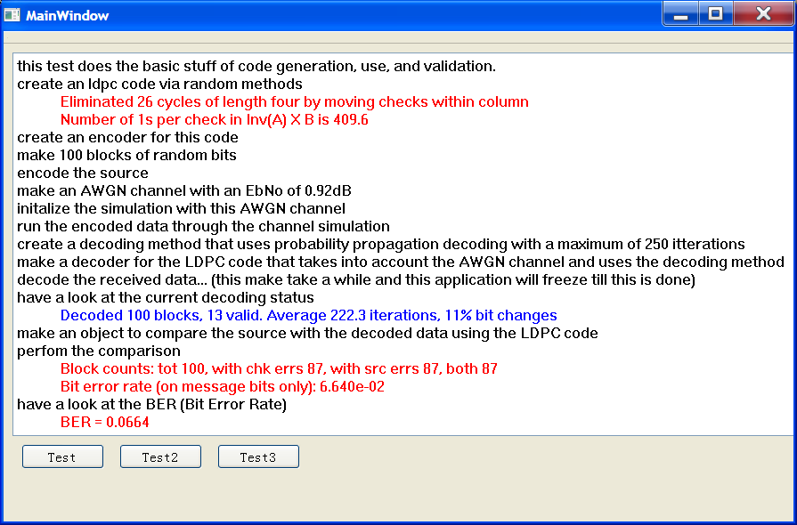

#Demo of how to use LDPC-4Qt

This directory contains a Qt GUI application demonstrating how to use LDPC-4Qt

It performs three simple tests.

1. Creation of a random LDPC code whereby random data is encoded, passed through an AWGN channel, decoded and the BER displayed.
2. The same test as one except it attempts to load an LDPC code from disk and if no such file exists is creates one randomly and saves it to disk for later.
3. The same as test one except it runs through many noise levels and stores its results in a file that can be opened using Octave or Matlab. This file displays a BER versus EbNo plot.

The following figure shows the plot obtained from the third test.

##Compiling

To compile this demonstration application it is suggested that Qt creator is used.

1. [Download the LDPC-4Qt repository](https://github.com/jontio/LDPC-4Qt/zipball/master).
2. Open [Demo.pro](Demo.pro) with Qt creator
3. Click Build in Qt creator
4. Copy [randfile](../LDPC-codes/randfile) to the same directory that that the executable that Qt creator built in step 3 resides.
5. Click Run in Qt creator

