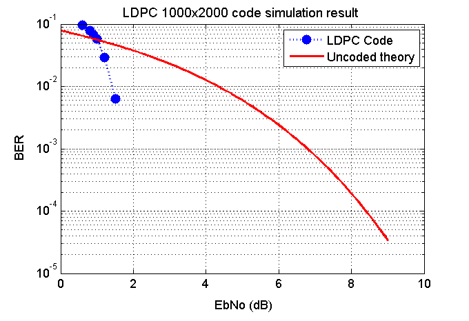

# LDPC-4Qt
A simple interface for forward error correction using LDPC codes.

LDPC-4Qt is a Qt C++ wrapper for the C implementation of [radfordneal/LDPC-codes](https://github.com/radfordneal/LDPC-codes) and allows a simple interface to LDPC codes using Qt C++. 

LDPC-4Qt can be used to easily encode and decode data without the need to fully understand LDPC codes. This makes it ideal for experimenting with LDPC codes and see if they are right for you.

#LDPC performance

LDPC (*Low Density Parity Check*) code are extremely good FEC (*Forward error correction*) codes. LDPC codes along with Turbo codes are arguably currently the most exciting FEC codes. They get the name "capacity approaching codes" meaning they get very close to the capacity limit that a channel can cope with.

The following figure shows the performance of a randomly generated 1000x2000 LDPC code in the presence of Additive White Gaussian Noise (*AWGN*).  This was obtained with the [Demo application](Demo) and plotted in Matlab.



What this plot is saying in a way, is, if you are transmitting data from A to B in the presence of AWGN (hissing sounding noise) then with this 1000x2000 LDPC code you can probably get away with using a quarter of the amount of power you would have to use otherwise without it. That's pretty amazing performance.

##Example usage

```C++
    //create an ldpc code via random methods
    LDPCCode ldpccode(1000,2000,2,LDPCMakeLDPC::Evenboth,"2x2/7x3/1x7",true);

    //create an encoder for this code
    LDPCEncode encode(ldpccode);

    //make 100 blocks of random bits
    QByteArray src;
    encode.createrandomdata(100,src);

    //encode the source
    QByteArray enc;
    encode.encode(src,enc);

    //make an AWGN channel with an EbNo of 0.92dB
    AWGNinfo channelinfo;
    channelinfo.setEbNo(0.92);

    //initalize the simulation with this AWGN channel
    LDPCTransmitSimulation txsim(channelinfo);

    //run the encoded data through the channel simulation
    QVector<double> rec;
    txsim.transmit(enc,rec);

    //create a decoding method that uses probability propagation decoding with a maximum of 250 itterations
    Prprpinfo decodingmethodinfo;
    decodingmethodinfo.max_iterations=250;

    //make a decoder for the LDPC code that takes into account the AWGN channel and uses the decoding method
    LDPCDecode decode(ldpccode,channelinfo,decodingmethodinfo);

    //decode the received data
    QByteArray dec;
    decode.decode(rec,dec);

    //have a look at the current decoding status
    qDebug()<<decode.getdecoingstatus();

    //make an object to compare the source with the decoded data using the LDPC code
    LDPCVerify verify(ldpccode);

    //perfom the comparison
    verify.verify(src,dec);
    
    //have a look at the BER (Bit Error Rate)
    qDebug()<<"BER ="<<verify.getber();
```

##Compiling

In your project you have to include `ldpc4qt.h` and compile and link with `ldpc4qt.cpp`. [randfile](LDPC-codes/randfile) should also be copied to the directory where the final application resides.

It is not necessary to compile anything in [LDPC-codes](LDPC-codes); compiling `ldpc4qt.cpp` takes care of the rest.


